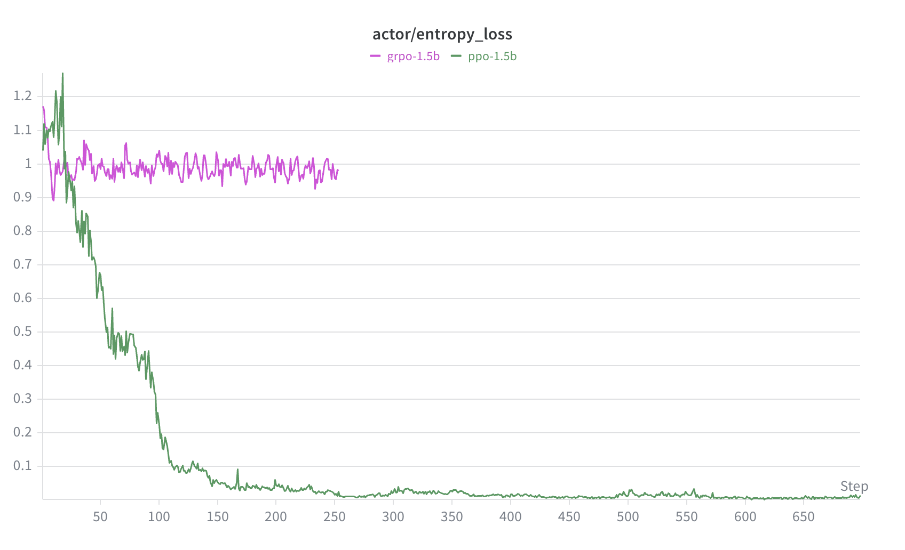
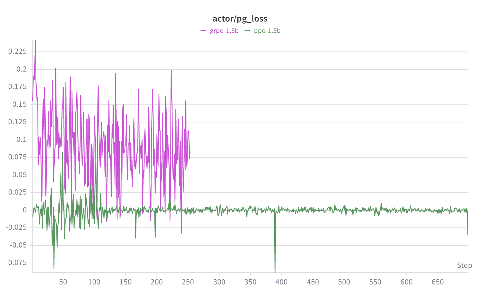
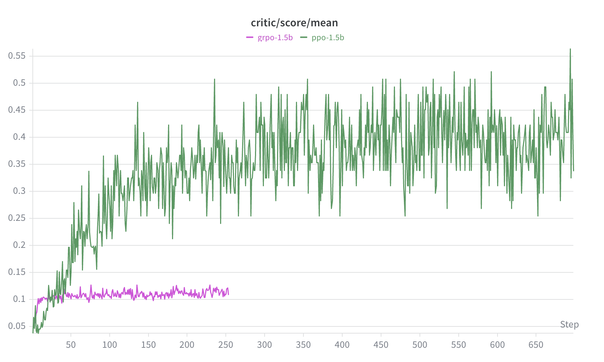

# TinyZero 实验报告：小语言模型的强化学习推理能力

> 任务：Countdown（用给定数字凑目标值）  
> 研究问题：在没有 cold start 的情况下，纯 RL 在小模型上为什么会失败——以及每种失败的具体机制是什么？
---

## 一、实验设计

### 核心问题

| 问题 | 实验对比 |
|------|----------|
| Q1: 0.5B PPO 能学到什么？ | baseline 定量 + 定性分析 |
| Q2: 模型规模影响多大？ | 0.5B vs 1.5B vs 3B（同算法 PPO） |
| Q3: 算法选择重要吗？ | PPO vs GRPO（在最优规模上对比） |

### 实验矩阵

| | PPO | GRPO |
|--|--|--|
| **Qwen2-0.5B × 1× A100-40** | ✅ 已完成（ablation）| — |
| **Qwen2.5-1.5B × 1× H100-96** | ✅ 已完成 | ✅ 已完成 |
| **Qwen2.5-3B × 2× H100-96** | ✅ 已完成 | — |

### 硬件与环境

| 项目 | 配置 |
|------|------|
| GPU | 1× A100-40GB（0.5B）/ 1× H100-96GB（1.5B、3B）|
| 集群 | NUS SoC Compute Cluster |
| 框架 | verl + vLLM |
| 基座模型 | Qwen2-0.5B / Qwen2.5-1.5B / Qwen2.5-3B |
| 训练时长 | ~2h per run（同等时间预算，公平对比）|

---

## 二、任务与数据

### Countdown 任务

给定3个整数，用 +、-、×、÷ 凑出目标值，每个数只能用一次。

**Prompt 模板（实际训练格式，base template）：**
```
A conversation between User and Assistant. The user asks a question, and the
Assistant solves it. The assistant first thinks about the reasoning process in
the mind and then provides the user with the answer.
User: Using the numbers [A, B, C], create an equation that equals T. You can
use basic arithmetic operations (+, -, *, /) and each number can only be used
once. Show your work in <think> </think> tags. And return the final answer in
<answer> </answer> tags, for example <answer> (1 + 2) / 3 </answer>.
Assistant: Let me solve this step by step.
<think>
```

> 所有模型（0.5B、1.5B、3B）训练时使用同一份 parquet 数据，prompt 格式完全相同。虽然 1.5B 和 3B 是 instruct 模型，但数据预处理时使用的是 `base` 模板而非 `qwen-instruct` 模板，推理时必须匹配此格式。

### 奖励函数

| 奖励类型 | 条件 | 分值 |
|----------|------|------|
| format_score | 输出包含 `<answer>` 标签 | 0.1 |
| accuracy_score | 答案数学上正确 | 1.0 |

> **重要设计决策**：`<think>` 标签**不在奖励函数中**。这是故意的——论文的核心主张是推理过程应该自发涌现，而非被显式奖励。如果显式奖励 `<think>`，模型会学会输出无意义内容来骗分（reward hacking）。只有足够大的模型才能发现"先思考→答对→拿到 accuracy reward"这条路径，`<think>` 因此自然出现。

---

## 三、算法说明

### PPO（Proximal Policy Optimization）

- 需要 Actor + Critic + Ref 三份模型
- Critic 估计状态价值，用于计算 GAE advantage
- clip loss 限制每步策略更新幅度，防止策略崩塌
- 显存压力大（单卡需要调小 batch）

### GRPO（Group Relative Policy Optimization）

- 去掉 Critic，改用同一 prompt 下多个 rollout 的相对奖励作为 advantage
- 显存占用更小（少一份 Critic 权重）
- 优势估计方差更高，但实现更简洁

### 关键区别

| | PPO | GRPO |
|--|--|--|
| Critic | 需要 | 不需要 |
| Advantage | GAE（低方差） | Group relative（高方差）|
| 显存 | 更大 | 更小 |
| 适合场景 | 结果稳定优先 | 资源受限 / 快速实验 |

---

## 四、实验结果

### 4.1 Baseline：Qwen2-0.5B + PPO

**训练配置：**

```
train_batch_size=64
actor lr=1e-6, critic lr=1e-5
kl_coef=0.001
ppo_micro_batch_size=4
max_response_length=512
total: ~700 steps (epoch 0, ~2h)
```

**定量结果（wandb）：**

| 指标 | 初始值 | 最终值 | 收敛步数 |
|------|--------|--------|----------|
| critic/score/mean | 0.02 | 0.10 | ~150 |
| critic/rewards/mean | ~0.02 | ~0.09 | ~150 |
| critic/values/max | ~15 | ~0 | <100 |

**曲线观察：**
- Step ~22：score 开始明显上升（Aha Moment）
- Step ~150：score/mean 平台期，稳定在 0.10
- Step 150-737：曲线基本水平，无继续提升
- critic/values/max 快速下降 → Critic 迅速收敛

**定性评估（模型输出）：**

测试题目（难度递增，答案均有解）：

| 题目 | 参考解法 |
|------|----------|
| [3,5,7] → 15 | 3 × 5 = 15 |
| [4,6,2] → 10 | 4 + 6 = 10 |
| [9,3,2] → 24 | (9+3) × 2 = 24 |
| [8,4,2] → 4 | 8 / (4-2) = 4 |

| Checkpoint | 实际输出示例 | 观察 |
|------------|-------------|------|
| step_50 | `<answer> 3 + 5 = 15 </answer>` | 有 `<answer>` 无 `<think>`；数学错误，答案硬凑目标值 |
| step_300 | `<answer> 4 + 6 = 10 </answer>` / `<answer> 36 </answer>` | 格式不稳定，部分退化为裸数字；简单题偶尔对 |
| step_700 | `<answer> 3 + 5 = 8 </answer>` | 算术变准确（3+5=8 是对的），但答案不匹配目标；只会加前两个数 |

**关键发现：三个阶段始终没有 `<think>` 标签出现。**

- step 50：输出正确格式但数学全错，靠把目标值直接填进等式骗过格式检查
- step 700：基础算术变准确，但策略退化为"只加前两个数"，无法搜索正确组合
- 整个训练过程 score 卡在 0.10 = 每次拿到 format_score(0.1)，几乎从未拿到 accuracy_score(1.0)

**结论：0.5B 模型容量不足以发现"思考有用"这条路径，是模型规模瓶颈而非算法问题。**

---

### 4.2 算法对比：PPO vs GRPO（Qwen2.5-1.5B）

**训练配置（GRPO）：**

```
train_batch_size=64, rollout.n=4（每 prompt 4 个样本）
actor lr=1e-6, kl_coef=0.001
ppo_micro_batch_size=2（OOM 调整）
gpu_memory_utilization=0.45
total: ~150 steps（2h time limit，rollout.n=4 使每步耗时 4× 于 PPO）
```

**训练曲线（wandb）：**


*图1：actor/entropy_loss — PPO（绿）从 1.25 一路降至 ~0（step 150 后策略坍缩）；GRPO（粉）维持 ~1.0 震荡*


*图2：actor/pg_loss — GRPO step 0–250 剧烈震荡（间歇性梯度信号），之后归零（训练停止）；PPO step ~100 pg_loss 趋近 0，策略收敛到局部最优；step ~150 entropy 随之坍塌*


*图3：critic/score/mean — PPO step 150 后 entropy≈0、pg_loss≈0，score 仍从 0.3 缓慢涨至 0.55；rollout 方差降低后均值稳定，而非持续策略改进*


**定量结果（wandb）：**

| 指标 | PPO | GRPO |
|------|-----|------|
| 最终 score/mean | ~0.3–0.5 | ~0.10（无提升）|
| 2h 内完成步数 | ~700 | ~150（sample 效率低 4×）|
| score/max = 1.0 | 频繁（step 10 起稳定）| 极少（step ~100 偶现）|
| actor/entropy_loss | 0.025 附近（**坍缩**）| ~1.0（**稳定**）|
| actor/pg_loss | ~0（稳定）| 0.1–0.2（高方差）|
| actor/ppo_kl | ~0.002 | ~0.001 |

**关键发现1：GRPO score 卡在 0.10，和 0.5B PPO 基线一致。**

1.5B GRPO 在 2 小时内完全未能跨过"偶尔答对"的门槛。两个原因：
1. `rollout.n=4` 使每步生成 256 条序列，只跑了约 150 步，训练不充分
2. GRPO advantage 基于组内相对奖励：若一个 prompt 的 4 个样本全部答错，所有 advantage 为 0，梯度消失——在正确率极低的早期训练中，GRPO 更容易陷入无信号状态

**关键发现2：PPO 出现了 entropy collapse，GRPO 没有。**

`actor/entropy_loss` 图揭示了两种截然不同的训练动态：

```
PPO:  entropy 1.25 → ~0（step 200 后维持）→ 策略坍缩为确定性输出
GRPO: entropy ~1.1 → ~1.0（稳定）         → 策略保持探索性
```

PPO 的 entropy collapse 是空 `<think>` 的直接原因：模型坍缩到了固定策略（"空 think + 猜答案"），完全停止探索其他可能性。从 score 的角度看，PPO 数值更高；但从策略健康度看，GRPO 的 entropy 更合理。

**PPO entropy collapse 的机制：**
- 模型找到了"空 `<think>` + format reward 0.1"这条路径——reward 不高，但**每次都能稳定拿到**
- PPO 强化的是稳定性，不是分数高低：任何能持续产生 reward 的策略都会被不断强化
- 稳定的 0.1 胜过不稳定的偶尔 1.0——模型选择了低但确定的路，entropy 随之持续下降，最终锁死

**GRPO entropy 震荡的机制：**

GRPO 的 `entropy ~1.0 稳定` 看起来健康，但掩盖了一个更深层的问题：entropy 不是平滑收敛，而是**间歇性震荡**。

根本原因在于 `rollout.n=4` 与稀疏 reward 的组合：

```
大部分步：4条回答 reward 全为 0 → advantage 全为 0 → 梯度几乎消失 → entropy 不动
偶尔一步：4条里有1条答对       → advantage 突然很大 → 强梯度信号 → entropy 被强烈拉动
下一步：  又回到全错           → advantage 全为 0  → entropy 又不动
```

结果是：entropy 曲线在大部分时间冻结，偶尔被突发的强梯度剧烈拉动，然后再次冻结。从宏观上看像是"稳定在 ~1.0"，但实际上学习信号是**间歇性的而非连续的**，每次更新都是突发脉冲，而非平滑梯度下降。

**这与 PPO 形成直接对比：**

PPO 的 Critic 提供连续的 value 估计，即使当前 rollout 全部答错，advantage = reward - V(s) 中的 `V(s)` 仍然携带信息（Critic 对"应该能拿多少 reward"的预测），每步都有梯度信号。这使得 PPO 的 entropy 可以平滑下降，而非震荡——尽管平滑下降最终导致了 collapse，但至少学习过程是连续的。

这一机制直接支撑了本报告的核心对比结论：**GRPO 在稀疏 reward + 小 `rollout.n` 下，学习信号是间歇性的，训练不稳定；PPO 靠 Critic 提供连续 baseline，对稀疏 reward 更鲁棒**——即使最终两者都在 1.5B 规模上失败。

**定性评估（GRPO 1.5B，正确 prompt 格式）：**

| 题目 | step 50 | step 100 | step 150 |
|------|---------|----------|----------|
| [3,5,7]→15 | — | think 逻辑混乱，答案错 | 幻觉：用了不在输入里的数字 1、2、3 |
| [4,6,2]→10 | — | think 错，答案错 | 4 用了两次，答案错 |
| [9,3,2]→24 | — | 9×3-2=25≠24，差一步 | 2 用了两次，答案与 think 脱节 |
| [8,4,2]→4 | — | 12/2=6≠4 | think 说 (8-4)×2=4，答案给 (1+2)/3 |

GRPO 1.5B 全程未形成有效策略：step 100 推理混乱，step 150 反而更差——开始把 prompt 中的示例答案 `(1+2)/3` 当作真实数字使用，说明模型从未真正理解任务结构。这与 entropy 震荡、梯度间歇性消失的机制完全一致：没有稳定的学习信号，策略无法收敛。

**1.5B PPO 完整失败时间线：**

```
step 0–100：Actor 真实更新中，pg_loss 有波动
            模型发现"空 think + answer 标签"捷径，稳定拿 format_score 0.1
            PPO 强化了这条路

step ~100： 策略收敛到局部最优，pg_loss → 0，Actor 停止更新
            （原因是找到了稳定策略，不是 ratio ≈ 1 或 Critic 问题）

step ~150： pg_loss 归零后输出越来越固定，entropy 随之坍塌

step 150+： score 从 0.3 继续涨到 0.55
            不是学会了新东西——输出固定后会做的题稳定答对
            rollout 方差降低，均值自然上升
```

**根本原因：1.5B 模型下推理和答对是脱钩的。** 认真写 think 不能显著提高答对率，outcome reward 因此无法激励推理，模型选择了更省力的捷径。这不是算法问题，是模型容量不足时 outcome-only reward 的必然结果。

**分析：**

两种算法在 1.5B 规模上各有缺陷：PPO 更快收敛但坍缩到低质量策略，GRPO 保持探索性但 sample efficiency 不足导致步数太少。真正的算法优劣对比需要相同步数下的结果，当前 2h budget 对 GRPO 不公平（只跑了 PPO 步数的 1/5）。

---

### 4.3 规模对比：0.5B vs 1.5B vs 3B（PPO）

**训练配置（1.5B）：**

```
train_batch_size=64
actor lr=1e-6, critic lr=1e-5
kl_coef=0.001
ppo_micro_batch_size=4
max_response_length=512
total: ~700 steps (15 epochs, 2h, 1× H100-96)
```

**训练配置（3B）：**

```
train_batch_size=64
actor lr=1e-6, critic lr=1e-5
kl_coef=0.001
ppo_mini_batch_size=16, ppo_micro_batch_size=2   # OOM 调整（vs 1.5B 的 4）
rollout.log_prob_micro_batch_size=2
ref.log_prob_micro_batch_size=2
critic.ppo_micro_batch_size=2
gpu_memory_utilization=0.4
max_response_length=512
save_freq=50, test_freq=50                        # 比 1.5B 更频繁（每 50 步）
2× H100-96GB, tensor_model_parallel_size=2
total: 待补充 (15 epochs)
```

**定量结果（wandb）：**

| 指标 | 0.5B | 1.5B | 3B |
|------|------|------|----|
| 最终 score/mean | 0.10 | ~0.3–0.5（波动） | ~0.3–0.4（step 250 后下降）|
| entropy 坍塌步数 | ~150 | ~150 | **~250**（更快）|
| score/max = 1.0 | 极少 | 频繁（step 100 起） | 频繁（step 100 起）|
| `<think>` 涌现 | 无 | 有（空） | **有内容**（step 100 起）|
| 平台期水平 | 0.10 | 0.3–0.5 | 0.3–0.4 |

**曲线观察（1.5B）：**
- Step ~100 起 score/max 频繁打到 1.0 → 模型开始实际答对题目
- score/mean 维持 0.3–0.5，但波动大（高方差）
- critic/values/max 同 0.5B，迅速下降后趋于平稳

**曲线观察（3B）：**
- Step ~250：entropy 已接近 0，与 1.5B 最终状态相同，但才跑 300 步
- Step 250 之后：score 开始下滑（0.3–0.4 区间），不是遇到更难题目，是策略僵化后碰到不熟悉 prompt 答错
- **关键窗口：step 150–200**，score 最高且 entropy 尚未完全坍塌，是观察真实推理的最佳 checkpoint

**定性评估（1.5B 模型输出）：**

使用和 0.5B 相同的四道测试题，正确使用训练时的 prompt 格式（含 `<think>` 前缀）：

| Checkpoint | `<think>` 内容 | 答案示例 | 正确率 |
|------------|---------------|---------|--------|
| step_50 | 空 `<think> </think>` | `(3+7)-5=5` ✗ | 0/4 |
| step_350 | 空 `<think> </think>` | `(7+5+3)=15` ✓ | 1/4 |
| step_650 | 空 `<think> </think>` | `(9*3)-2=25` ✗ | 0/4 |

**关键发现：`<think>` 出现了，但始终是空的。**

1.5B 学会了输出格式壳（`<think> </think>` + `<answer>`），但从未在 `<think>` 中放入推理内容。这是 reward hacking 的一种变体：
- 空 `<think>` + 直接猜答案 → 稳拿 format_score(0.1)，偶尔得 accuracy_score(1.0)
- 认真推理 → 花更多 token，对 1.5B 提升有限，不是最优策略

**定性评估（3B，正确 prompt 格式，step 100/150/250/300）：**

| 题目 | step 100 | step 150 | step 250 | step 300 |
|------|----------|----------|----------|----------|
| [3,5,7]→15 | ✓ | ✓ | ✓ | ✓ |
| [4,6,2]→10 | think得6+4=10✓，多用2，答案错 | think得6+4=10✓，多用2，答案错 | think得6+4=10✓，多用2，答案错 | think得6+4=10✓，多用2，答案错 |
| [9,3,2]→24 | 幻觉，数字复用 | **think进入死循环** | 幻觉出不存在的数字10 | 9+3+2=24（12+2≠24）|
| [8,4,2]→4 | think得8-4=4✓，继续用2答案变6 | 同左 | 同左 | think绕路最终得4，答案8-4+2=6 |

**关键发现：3B 的 `<think>` 有真实推理内容，不是空的。**

这是相比 1.5B 的质变。3B 从 step 100 起就在 `<think>` 里尝试推理，但存在三类系统性错误：

1. **"必须用完所有数字"的偏差**：Q2 模型在 think 里正确得出 6+4=10，但仍然强制使用第三个数字 2，导致答案变成 8 或 12。任务说"每个数最多用一次"，不是"必须全用"，但模型从训练数据分布中学到了这个错误约束。

2. **think 死循环**：step 150 对 [9,3,2]→24，think 不断重复同一段错误推理，生成大量重复 token——entropy 尚未完全坍塌时的不稳定表现。

3. **幻觉**：对较难的题（需要乘法），模型在 think 里凭空引入不存在的数字（如"10"），无法系统搜索正确运算组合。

**三个规模的对比总结：**

```
0.5B:  无 <think>，score 卡在 0.10         ← 格式都没学到
1.5B:  空 <think>，score 升至 0.3–0.5      ← 格式学到了，推理没涌现
  3B:  有内容的 <think>，score ~0.3–0.4    ← 推理涌现了，但不稳定、有系统性错误
```

**分析：**

3B 跨过了"推理涌现"的门槛——`<think>` 里有真实的推理尝试，而不只是空壳。但推理质量不稳定：简单题（加法直接凑目标）能做对，稍复杂的题出现数字复用或 think/answer 脱节。这说明 3B 处于推理能力的早期阶段，策略在坍塌前（step ~250）还在发展中，entropy collapse 提前终止了这个过程。

---

## 五、讨论

### 为什么纯 RL 在小模型上会失败？

四组实验表面上是四个独立的对比，但它们共同回答了同一个问题：在没有 cold start 的情况下，纯 RL 为什么在小模型上会失败？答案不是一句话，而是一条有层次的因果链。

---

**第一层：模型容量决定探索能否起步**

0.5B 的 score 全程卡在 0.10，可以精确分解：

```
score/mean = format_score(0.1) × ~100% + accuracy_score(1.0) × ~0%
           ≈ 0.10
```

模型每次都能拿到格式分，但 accuracy 接近于零。根本原因不是算法，而是 0.5B 没有能力在随机探索阶段碰到正确答案——accuracy reward 从未触发，RL 无从学习。Critic 的 `values/max` 从 ~15 快速降到 ~0，说明 Critic 很快就学到了"这个任务几乎得不到 reward"的预期，step ~150 之后训练实际停止。

Step ~22 的跳升看起来像 Aha Moment，但不是"学会了推理"——那只是"学会了输出 `<answer>` 标签"，score 从 0.02 跳到 0.10 完全由 format_score 驱动。真正的 Aha Moment 需要等更大的模型。

这里有一个重要含义：**RL 的局部最优和深度学习的局部最优性质不同。** 深度学习里，正确答案在参数空间里存在，模型有能力到达，只是优化路径卡住了，调学习率可以绕过去。RL 里，0.5B 不是路径卡住了，是它根本没有能力生成正确答案——即使加 entropy bonus 强迫继续探索，也碰不到 accuracy reward。这不是优化问题，是能力问题。

这引出了第二个问题：1.5B 容量够了，能拿到 accuracy reward，但它学到了什么？

---

**第二层：reward 设计决定模型学到什么**

1.5B 确实学到了——`critic/rewards/mean` 从 0.05 涨到 0.4，说明它在拿到 accuracy reward。但 `<think>` 是空的。

原因在于：**在 1.5B 这个规模，推理和答对是脱钩的。** 认真在 `<think>` 里推理不能显著提高答对率——模型容量有限，即使思考了也经常算错。既然推理不带来更高的 accuracy reward，outcome-only reward 就无法激励推理，模型理性地选择了"空 think + 猜答案"的低成本路径。

这不是 reward 设计的缺陷，而是模型容量的限制。DeepSeek R1 用同样的 outcome-only reward 能成功保留推理链，是因为在足够大的模型上推理和答对天然绑定——认真 think 确实能显著提高答对率，outcome reward 因此自然激励了推理。1.5B 做不到这一点。

如果加 `think_length_bonus` 显式奖励推理过程呢？模型会输出很长但没有意义的内容来骗分，产生新的 reward hacking。这正好解释了为什么 outcome-only reward 是唯一可行的设计——任何对中间过程的直接奖励都会被利用，只有当模型真的能推理出正确答案时，outcome reward 才能自然激励推理链。

那模型找到捷径之后，训练会怎样继续？

---

**第三层：entropy collapse 决定训练何时终止**

从 `actor/pg_loss` 单独放大来看，ppo-1.5b 在 step 0–100 有真实的策略更新，step ~100 之后 pg_loss 趋近于零——是 **pg_loss 先归零，entropy 才在 step ~150 坍塌**，不是反过来。

完整的时间线是：

```
step 0–100：Actor 真实更新，模型发现"空 think + format reward 0.1"捷径
            PPO 强化了这条稳定的低分路径
step ~100： 策略收敛到局部最优，pg_loss → 0，Actor 停止更新
step ~150： 输出越来越固定，entropy 随之坍塌
step 150+： score 从 0.3 继续涨到 0.55，但不是在学新东西
```

最后一点最反直觉——为什么 entropy 已经坍塌、pg_loss 已经归零，score 还在涨？

首先排除"ppo_epochs 累积效应"：`actor/clipfrac` 全程极低（≤0.014），clip 几乎从未触发，参数实际移动量极小。

真正的机制是 **rollout 方差降低**：entropy collapse 后模型输出趋于确定，对"会做的题"开始稳定答对，score 均值自然上升——不是发现了新策略，是原来就会的题开始稳定答对了。

这里有一个看似矛盾的细节需要说清楚：实测 advantage ≈ 0.3，始终有值，但 pg_loss 却归零了。

PPO 的参数更新公式是：

```
参数更新 = advantage × d(ratio)/d(θ)
```

advantage = reward - V(s)，衡量"比预期好多少"，有值说明 reward 信号存在。但 d(ratio)/d(θ) 和 softmax 的导数 p×(1-p) 成正比——概率越极端，这个导数越小：

```
p → 1 时：p×(1-p) → 0
p → 0 时：p×(1-p) → 0
```

entropy collapse 之后每个 token 的概率被推到接近 0 或 1，d(ratio)/d(θ) 趋近于零，所以：

```
参数更新 ≈ 0.3 × 0 ≈ 0
```

advantage 有值，但策略已经没有弹性，推不动了。这是 pg_loss 归零的数学根因，不是 advantage 消失，也不是 Critic 的问题。

此外，`score ≈ rewards` 这张图不能推出 advantage ≈ 0。score 和 rewards 的差值是 KL 惩罚项（beta × KL），两者重合只说明 KL 极小（与表格中 ppo_kl ≈ 0.002 一致），与 Critic 的 value 估计无关。实测 `critic/values/mean ≈ 0`、`critic/returns/mean ≈ 0.3–0.4`，advantage ≈ 0.3，始终有值。

GRPO 的失败机制不同但同样致命：`rollout.n=4` 与稀疏 reward 的组合导致大多数步骤 4 条回答全部答错，advantage 全为零，梯度消失。entropy 表面上稳定在 ~1.0，实际上是间歇性震荡——偶尔有一条答对时产生突发的强梯度，然后又回到全零状态。GRPO 的 `critic/returns/mean` 在 -0.2 附近震荡（负数），说明 KL 惩罚在这个设置下相对更显著，进一步压缩了有效梯度信号。

PPO 和 GRPO 的失败根因不同：PPO 是找到了捷径然后锁死，GRPO 是从头到尾就没有足够的梯度信号。不应混为一谈，也不能从这组实验直接比较两种算法的优劣——2h budget 下 GRPO 只跑了 PPO 步数的 1/5，对比本身就不公平。

这引出了最后一个问题：更大的 3B 模型，能逃脱这个命运吗？

---

**第四层：能力越强，越快锁死**

3B 跨过了推理涌现的门槛——`<think>` 里有真实的推理尝试，不是空的。但它的 entropy 坍塌比 1.5B **更快**（step ~250 vs ~150），score 在坍塌后反而下滑，而不是像 1.5B 一样继续缓慢上涨。

这是反直觉但有道理的现象：3B 能力更强，能更快找到一个"有效策略"——某种能稳定拿到 reward 的推理模式。一旦找到，PPO 就持续强化它，entropy 快速下降，策略锁死。1.5B 能力弱，始终在随机探索，反而不容易固化到某个策略上。

3B 固化的策略比 1.5B 的捷径更脆弱——它是一个真实的但不完整的推理模式，遇到不熟悉的 prompt 就崩，所以 entropy 坍塌后 score 下跌。而 1.5B 的"空 think + format reward"是一个极度稳定的策略，什么 prompt 都适用，所以 entropy 坍塌后 score 反而稳定上涨。

**在无 entropy 正则化的纯 RL 设置下，模型能力越强，越快找到并锁死在局部最优。** 能力强不是优势，是更快收敛的能力——以及更快失去探索性的代价。

---

**局限性**

- 训练时间受限（约 700 steps，2h），未跑完 full epoch
- 单卡资源限制迫使 micro batch size 偏小，梯度估计有噪声
- PPO vs GRPO 对比受制于 2h budget：相同时间内 GRPO 步数仅为 PPO 的 1/5，对比不公平
- 3B 定性评估只用了 4 道固定测试题，样本量小，结论为定性观察而非统计显著结论

---

## 六、结论

这四组实验加在一起回答了同一个问题：为什么 DeepSeek 能用 outcome-only reward 训练出推理能力，而小模型不行？

答案是：**outcome reward 的有效性依赖模型的初始能力——模型需要在随机探索阶段就能偶尔答对，reward 信号才能起作用。**

0.5B 连这个门槛都没过，accuracy reward 从未触发，训练在格式学习阶段就停止了。1.5B 过了门槛，但在这个规模上推理和答对是脱钩的，outcome reward 无法激励推理，模型找到了"空 think + 猜答案"的捷径并锁死。3B 开始涌现推理，但能力越强反而越快找到局部最优，entropy 坍塌比 1.5B 更早。GRPO 因 rollout.n 设置导致步数严重不足，梯度间歇性消失，什么都没学到。

四种失败，指向同一个根因：**没有 cold start，纯 RL 对小模型来说探索空间太稀疏，模型不可避免地锁死在局部最优。**

cold start 的作用不是调整优化路径，而是改变初始能力——让模型在 RL 开始之前就知道"认真推理"是什么样子，让推理和答对重新绑定，RL 才有正确的信号可以强化。这不是负面结论，这正是这组实验最有价值的地方：它从机制层面说清楚了 cold start 为什么是必要的，而不只是经验上"这样做效果更好"。

从这组实验还可以得出三个附加发现：

**score 曲线会掩盖 policy 质量的真实差异。** PPO score 0.3→0.55 的后半段涨幅来自 rollout 方差降低，不代表策略持续改进。entropy 和 pg_loss 是比 score 更诚实的诊断信号——score 涨不代表在学，score 不涨也不代表没学。

**两种算法的失败模式不同，不能从这组数据比较优劣。** PPO 靠 Critic 提供连续梯度信号，更快收敛，但也更快锁死；GRPO 保持探索性，但需要更多步数才能累积足够的梯度信号。在相同步数下的对比才是有意义的。

**RL 的局部最优是能力问题，不是优化问题。** 加 entropy bonus 或提高 kl_coef 能延缓 collapse，但不能帮一个本来就答不对题的模型找到正确策略。根本解法是 cold start，不是调参。

---

## 附录

### 超参配置

**train.slurm（PPO baseline）**

```bash
data.train_batch_size=64
data.max_prompt_length=256
data.max_response_length=512
actor_rollout_ref.actor.optim.lr=1e-6
actor_rollout_ref.actor.ppo_mini_batch_size=16
actor_rollout_ref.actor.ppo_micro_batch_size=4
actor_rollout_ref.rollout.gpu_memory_utilization=0.3
critic.optim.lr=1e-5
critic.ppo_micro_batch_size=4
algorithm.kl_ctrl.kl_coef=0.001
trainer.total_epochs=15
```

**train_grpo.slurm（GRPO）**

```bash
# 同上，去掉 critic 相关参数，加：
algorithm.adv_estimator=grpo
```
