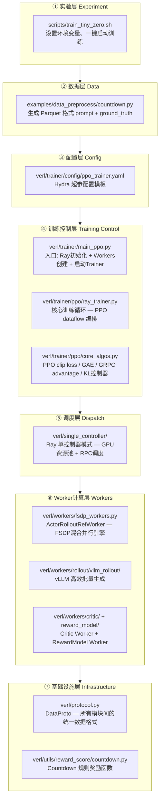
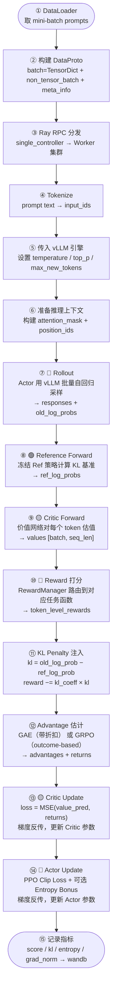
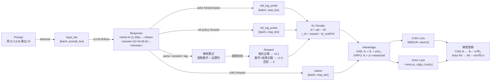

Let me先深入阅读关键模块，确保图表和大纲准确。      

Read 

Read 

Read 

Read 

Read 

Read , lines 1 to 120

Read , lines 121 to 350

Read 

Read 

Read 

Read , lines 1 to 80

Read , lines 350 to 550

Read , lines 1 to 60

Read , lines 1 to 60

Read , lines 1 to 80

Read , lines 550 to 690

Read , lines 60 to 200

Now let me load the Mermaid diagram tool to render the architecture visuals. 

已完成所有图表和源码分析。以下是完整输出：

---

# TinyZero 项目全景分析

## 一、项目定位

TinyZero 是 **DeepSeek R1 Zero 的轻量复现**，目标是用 RL（PPO/GRPO）让一个 3B 参数的基座语言模型**自发涌现推理能力**（自我验证 + 搜索），核心构建在字节跳动的 [veRL](https://github.com/volcengine/verl) 框架之上。训练成本不到 $30，非常适合入门学习。

---

## 二、架构总览图

> 7 层架构，从上到下是"实验 → 数据 → 配置 → 训练控制 → 调度 → Worker 计算 → 基础设施"。

### 各层详解

| 层 | 关键文件 | 职责 |
|---|---|---|
| **实验层** | scripts/train_tiny_zero.sh | 设置环境变量，一键启动训练 |
| **数据层** | examples/data_preprocess/countdown.py | 生成 Parquet 格式的 prompt + ground_truth 数据 |
| **配置层** | verl/trainer/config/ppo_trainer.yaml | Hydra 配置模板，定义所有超参 |
| **训练控制层** | verl/trainer/main_ppo.py | 入口：初始化 Ray → 创建 Workers → 启动 Trainer |
| | verl/trainer/ppo/ray_trainer.py | 核心训练循环（PPO dataflow 编排） |
| | verl/trainer/ppo/core_algos.py | PPO clip loss、GAE、GRPO advantage、KL 控制器 |
| **调度层** | verl/single_controller/ | Ray-based 单控制器模式，管理 GPU 资源池 |
| **Worker 计算层** | verl/workers/fsdp_workers.py | `ActorRolloutRefWorker` 混合引擎（FSDP 并行） |
| | verl/workers/rollout/vllm_rollout/ | 基于 vLLM 的高效批量生成 |
| **基础设施层** | verl/protocol.py | `DataProto`：所有模块间的统一数据格式 |
| | verl/utils/reward_score/countdown.py | Countdown 任务的规则奖励函数 |

---

## 三、PPO 训练数据流向图

> 展示一次完整训练从数据准备到梯度更新的 15 步流程。

### 关键流程说明

1. **步骤 7 (Rollout)**：Actor 用 vLLM 给 prompt 批量采样，产出 `responses` + `old_log_probs`
2. **步骤 8 (Ref)**：参考策略计算 `ref_log_prob`，用于 KL 散度约束
3. **步骤 9 (Critic)**：价值网络估计每个 token 的 value
4. **步骤 10 (Reward)**：`RewardManager` 根据数据来源选择打分函数（countdown 任务用规则打分）
5. **步骤 11-12 (Advantage)**：在 driver 进程上轻量计算 KL penalty → GAE/GRPO advantage
6. **步骤 13-14 (Update)**：分别更新 Critic 和 Actor 的参数

---

## 四、单步训练内部数据流（以 Countdown 为例）

> 展示 prompt → response → 奖励 → 梯度 的精确数据变换链路。

**Countdown 奖励打分逻辑**（verl/utils/reward_score/countdown.py）：
- 格式正确（有 `<answer>` 标签）→ +0.1 分
- 等式使用了正确的数字且结果等于 target → +1.0 分
- 否则 → 0 分

---

## 五、从 0 入门 LLM 算法工程师 — 基于 TinyZero 的学习大纲

### 第一阶段：基础知识储备（理论先行）

| 编号 | 主题 | 学什么 | 推荐资源 |
|---|---|---|---|
| 1.1 | **Transformer 架构** | Self-Attention、FFN、位置编码、KV Cache | *Attention Is All You Need* |
| 1.2 | **语言模型基础** | Causal LM、Tokenizer、生成策略（sampling/beam search） | HuggingFace Transformers 文档 |
| 1.3 | **强化学习基础** | MDP、策略梯度、值函数、GAE、PPO Clip | Sutton《RL: An Introduction》Ch13 |
| 1.4 | **RLHF 范式** | SFT → RM → PPO 三阶段，为什么需要 KL 约束 | Anthropic RLHF 论文 |

### 第二阶段：跑通 TinyZero（动手实践）

| 编号 | 主题 | 对应代码 | 你要做的 |
|---|---|---|---|
| 2.1 | **环境搭建** | README.md 安装部分 | 按步骤装好 conda 环境、vllm、flash-attn |
| 2.2 | **数据准备** | examples/data_preprocess/countdown.py | 读懂 prompt 模板构造，生成 parquet 数据集 |
| 2.3 | **启动训练** | scripts/train_tiny_zero.sh | 单卡跑 0.5B 模型，观察 wandb 曲线 |
| 2.4 | **观察 "Aha Moment"** | wandb 日志 | 关注 score 曲线、response 中 `<think>` 的涌现 |

### 第三阶段：理解训练框架（代码精读）

按照数据流顺序，建议阅读顺序：

| 编号 | 文件 | 核心概念 | 重点关注 |
|---|---|---|---|
| 3.1 | verl/protocol.py | `DataProto` | 理解 batch（TensorDict）+ non_tensor_batch + meta_info 三层结构 |
| 3.2 | verl/trainer/main_ppo.py | 训练入口 | `RewardManager` 如何路由不同任务的打分函数；Ray 初始化 |
| 3.3 | verl/trainer/config/ppo_trainer.yaml | Hydra 配置 | 理解 actor_rollout_ref / critic / algorithm / trainer 四大配置块 |
| 3.4 | verl/trainer/ppo/ray_trainer.py | PPO 主循环 | **最核心文件**：`fit()` 方法中 15 步 dataflow 编排 |
| 3.5 | verl/trainer/ppo/core_algos.py | 算法实现 | `compute_policy_loss`（PPO clip）、`compute_gae_advantage_return`、`compute_grpo_outcome_advantage` |
| 3.6 | verl/utils/reward_score/countdown.py | 奖励函数 | 规则打分：解析 → 验证 → 评分 |

### 第四阶段：理解分布式系统（工程深入）

| 编号 | 文件 | 核心概念 |
|---|---|---|
| 4.1 | verl/workers/fsdp_workers.py | FSDP 混合引擎：一个 Worker 同时做 Actor + Rollout + Ref |
| 4.2 | verl/workers/rollout/vllm_rollout/ | vLLM 推理集成：tensor parallel、KV cache 管理 |
| 4.3 | verl/single_controller/ray/ | Ray 单控制器模式：RPC 调度、资源池、colocated worker |
| 4.4 | verl/workers/sharding_manager/ | FSDP ↔ vLLM 权重转换 |

### 第五阶段：实验拓展（能力进阶）

| 编号 | 任务 | 涉及文件 |
|---|---|---|
| 5.1 | **自定义任务** | 仿照 countdown.py 写新的数据预处理 + 奖励函数 |
| 5.2 | **PPO vs GRPO 对比** | 改 `algorithm.adv_estimator` 切换 gae/grpo，对比 wandb 曲线 |
| 5.3 | **Instruct 模型对比** | 用 qwen-instruct 模板重做数据，观察 instruct vs base 的差异 |
| 5.4 | **扩大模型规模** | 1.5B → 3B → 7B，调整 TP_SIZE、batch_size、lr |
| 5.5 | **添加 Model-based RM** | 启用 `reward_model.enable=True`，接入 RewardModelWorker |

### 第六阶段：论文与前沿（视野拓展）

| 论文 | 与 TinyZero 的关系 |
|---|---|
| *DeepSeek R1 Zero* | TinyZero 复现的目标论文 |
| *PPO: Proximal Policy Optimization* (Schulman 2017) | 核心训练算法 |
| *GRPO* (DeepSeek Math) | 本项目支持的另一种 advantage 估计 |
| *InstructGPT* (Ouyang 2022) | RLHF 三阶段范式的开创论文 |
| *APR: Adaptive Parallel Reasoning* | TinyZero 团队的后续工作 |

---

### 建议的阅读顺序（一句话总结）

> **先跑通** (第 2 阶段) → **读 ray_trainer.py 的 `fit()` 理解 PPO 循环** (3.4) → **读 core_algos.py 理解算法** (3.5) → **读 protocol.py 理解数据格式** (3.1) → **读 worker 理解分布式** (第 4 阶段) → **改任务做实验** (第 5 阶段)