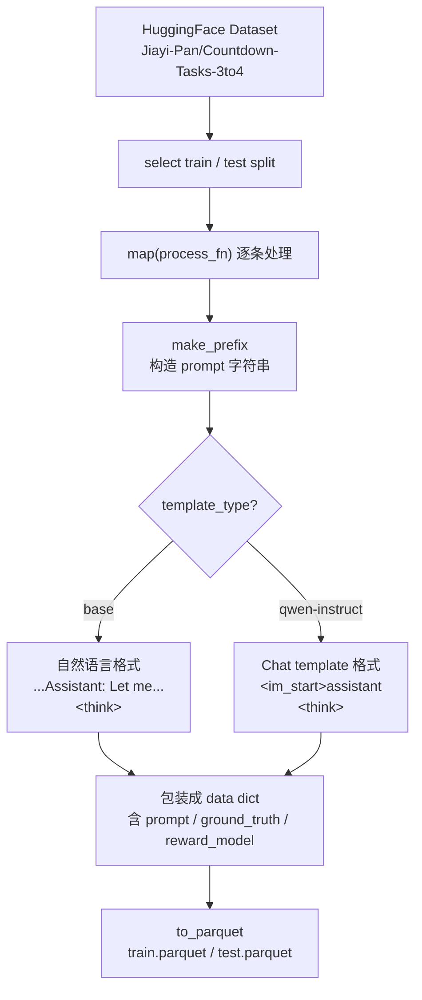
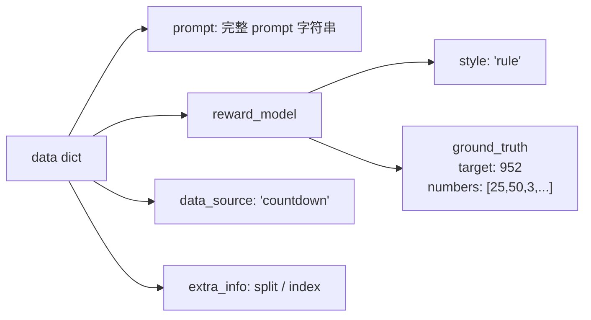
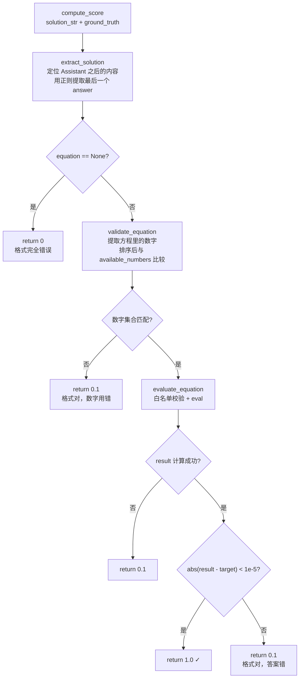
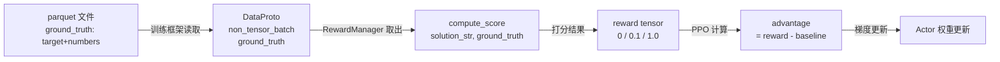

# Day 2-1 复盘：任务理解 + 训练曲线解读

---

## 一、这条训练在做什么任务

**任务名：Countdown（数字倒计时）**

> 给你一个目标数（如 952）和 6 个数字（如 [25, 50, 75, 100, 3, 6]），
> 用 +、-、×、÷，每个数字最多用一次，凑出目标数。

训练目标：让 Qwen2-0.5B **不靠人类示范**，通过强化学习**自己学会"先思考再作答"**。
这是 DeepSeek-R1 的核心思想的最小可复现版本。

---

## 二、数据流：一条样本长什么样

`countdown.py` 把数据集处理成固定格式的 prompt：

```
User: Using the numbers [25, 50, 3, 100, 6, 75], create an equation that equals 952.
      Show your work in <think> </think> tags.
      Return the final answer in <answer> </answer> tags.
Assistant: Let me solve this step by step.
<think>                ← 模型从这里开始生成
```

模型需要输出的格式：
```
<think> 推理过程 </think>
<answer> 25 * (50 - 6) / 3 </answer>
```

**关键设计**：prompt 以 `<think>` 结尾，强制模型先进入"思考模式"再给答案。

---

## 三、奖励函数：Rule-Based，三档打分

`verl/utils/reward_score/countdown.py` 的 `compute_score()`：

```
模型输出
   ↓
① extract_solution()  → 用正则提取 <answer>...</answer> 里的内容
   ↓
② validate_equation() → 检查方程里的数字集合 == 题目给的数字集合（排序后完全相等）
   ↓
③ evaluate_equation() → eval() 安全计算方程值
   ↓
打分：
  无 <answer> 标签        → 0     （格式完全错误）
  有标签但数字用错/算错   → 0.1   （格式对，内容错）
  答案正确                → 1.0   （完全正确）
```

**面试考点：为什么用 Rule-Based 而不是 Reward Model？**
- 有客观标准（方程结果可验证）→ 规则打分比模型打分更准确、更稳定
- 没有 reward hacking（模型无法"糊弄"一个固定规则）
- 省去 RM 训练成本

**面试考点：什么任务不能用 Rule-Based？**
- 开放式问答、写作、对话质量 → 没有客观答案 → 必须训 Reward Model
- 代码生成 → 可以 Rule-Based（跑单元测试，pass=1, fail=0）

---

## 四、训练循环：一个 Step 发生了什么

```
① 从 train.parquet 取一批 prompt（batch_size=64）
         ↓
② Actor（Qwen2-0.5B）用 vLLM 快速推理，生成完整回答
         ↓
③ compute_score() 给每条回答打分（0 / 0.1 / 1.0）← 这就是 reward
         ↓
④ Critic 估计每个状态的基准价值（value baseline）
   advantage = reward - baseline  ← 比平均好还是差
         ↓
⑤ PPO 更新 Actor：
   - advantage > 0 → 这类 token 概率 ↑
   - advantage < 0 → 这类 token 概率 ↓
   - KL 惩罚：别跑太远离初始模型
         ↓
⑥ 循环，共 15 个 epoch
```

---

## 五、训练曲线解读（重点）

### critic/score/mean — 最重要的曲线

本质：每个 Step 里所有样本 reward 的均值。
- 从 0.02 → 0.08：越来越多的回答从 0 跳到 0.1 或 1.0
- **Step 22 的 Aha Moment**：模型突然稳定学会输出 `<answer>` 格式，
  大量回答从 0 升到 0.1，均值因此跳升

---

### actor/entropy_loss — 模型的"犹豫程度"

熵 = 输出概率分布的均匀程度：
- **高熵** → 每个 token 概率差不多 → 模型在随机探索
- **低熵** → 某个 token 概率远高于其他 → 模型有固定策略

```
你的曲线形状：  1.6 → 0.6 → 0.9

Step 0~30    熵高(1.6)：模型什么都不会，随机输出
Step 30~110  熵急剧下降：学会了"要输出<answer>标签"这个固定格式，
                        变得机械重复 → 熵塌缩
Step ~110    熵最低(0.55)：策略僵化，只会套格式不会算数
Step 110~250 熵回升(0.9)：学会格式后开始探索不同的算式组合，
                          进入"学推理"阶段
```

**面试考点**：熵先跌后涨是 RL 训练的典型模式。涨回来是好事，说明模型没有"策略崩塌"（只会一招）。

---

### actor/ppo_kl — 当前策略和初始策略的距离

计算方式（注意：不是严格数学 KL，是 log ratio 估计值）：
```
KL_per_token = log π_current(token) - log π_ref(token)
```

| 值 | 含义 |
|----|------|
| 正数 | 当前模型对这个 token 比初始模型更自信（概率升） |
| 负数 | 当前模型对这个 token 比初始模型更不确定（概率降） |

**你的曲线**：KL 在 ±0.003，非常小 → 模型基本没跑偏。
原因：`kl_coef=0.001` 的惩罚在主动压制偏离，这是健康的信号。

**面试考点**：KL 过大说明模型跑偏，可能 reward hacking；KL 为零说明完全没学到东西。

---

### actor/pg_loss — 参数调整方向

```
pg_loss = -advantage × log π(action)
```

| 符号 | 含义 |
|------|------|
| 负值 | advantage > 0，好的回答，梯度推动概率↑ |
| 正值 | advantage < 0，坏的回答，梯度推动概率↓ |

波动正常，代表每批样本里好坏参半。
Step 100 后中枢收敛到 0 附近 → reward 方差下降，输出趋于稳定。
Step 200 的尖峰 = entropy 反弹时的探索阶段，三条曲线是联动的。

---

## 六、四条曲线的联动关系（串起来看）

```
时间轴：    0────────30────────110────────200────────250
                     |          |           |
score/mean:   平稳低  |  缓慢上升 |   继续上升  |
                     ↑          ↑
entropy:      高→急降  最低点    反弹回升
pg_loss:      大波动   趋于平稳  局部尖峰
ppo_kl:       接近0   接近0     接近0（全程受控）

Step 30  = 模型学会格式（entropy 塌缩，score 开始涨）
Step 110 = 策略进入探索（entropy 反弹，pg_loss 尖峰联动）
```

**看图的方法**：不要孤立看每条曲线，要问"这几条曲线在同一个时间点发生了什么？"
拐点联动 = 训练阶段切换的信号。

---

---

## 七、控制流 & 数据流图

### 数据预处理流（data_preprocess/countdown.py）



**data dict 的结构：**


---

### 打分控制流（reward_score/countdown.py）



---

### 端到端数据流（ground_truth 的完整旅程）



> ⚠️ DataProto 内部结构（non_tensor_batch 三层）待读 `protocol.py` 后补充

---

## Day 3 任务

精读 `verl/trainer/ppo/core_algos.py`，重点：
1. `compute_policy_loss` — clip loss 怎么实现的
2. `compute_gae_advantage_return` — GAE 公式对应代码的哪几行
3. 能用数字手算 GAE（3个token的序列），对照代码验证
