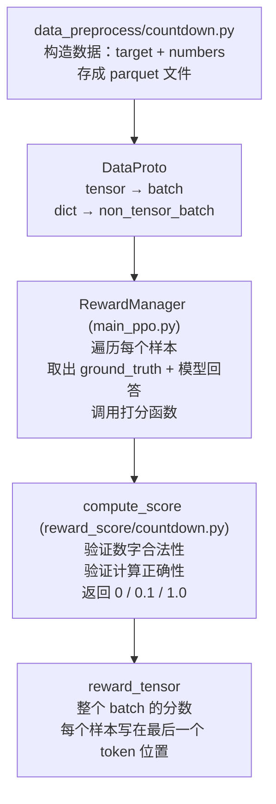

# Day 2-3：Reward 数据流

## DataProto 是什么

一个标准化容器，把所有数据按类型分到两个槽：
- `batch`（TensorDict）：能变成数字矩阵的 → 例如 input_ids/attention_mask/responses
- `non_tensor_batch`（dict）：Python 对象，形状不固定 → 例如 reward_model/data_source

好处：所有模块只和 DataProto 一个接口打交道。

attention mask：由于输入的tensor形状要统一，而实际输入的文本长短不一，所以用padding去对文本到tensor的映射做一个填充。短文本要补0。
0/1 的 mask 标记：1 = 真实 token，0 = padding 忽略。

---

## Reward 数据流：四个站点

---

## 遗留问题

- [ ] reward_tensor 写在最后一个 token 位置，为什么？（GAE 相关，Day 3 再看）
