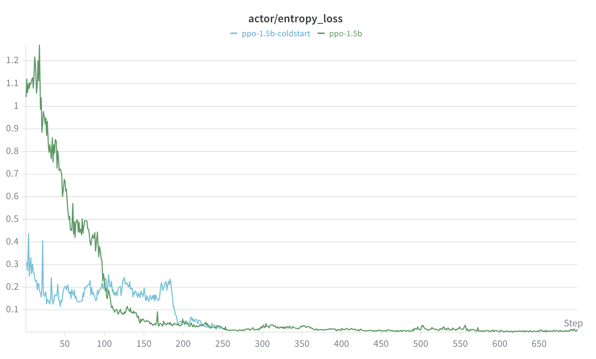
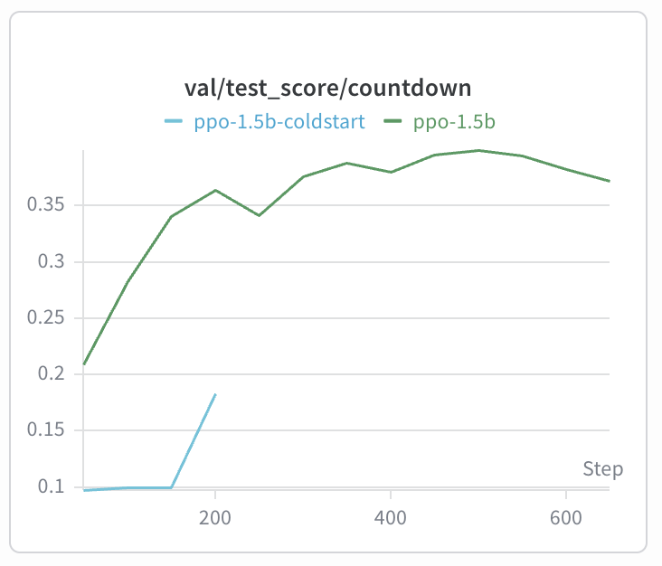
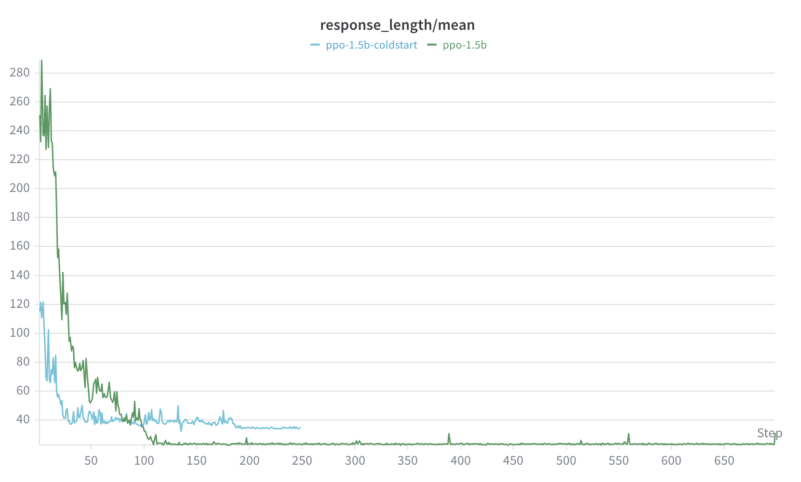
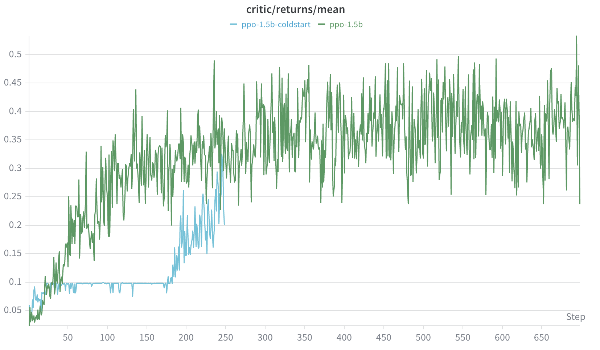

# PPO + SFT Cold Start 对比实验：Qwen2.5-1.5B

> **实验背景**：在主报告的 PPO 规模消融实验（0.5B / 1.5B / 3B）中，1.5B 模型在整个训练过程中 `<think>` 标签始终为空——模型学会了"输出格式"，但没有生成推理内容。本实验以此为出发点，在 1.5B 模型上引入 SFT Cold Start，观察是否能改变这一行为，并对比两种初始化方式在 PPO 训练中的差异。

---

## 一、实验设计

### 对比组

| | 实验名 | 初始模型 | PPO 配置 |
|--|--------|---------|---------|
| **A（对照）** | `ppo-1.5b` | Qwen2.5-1.5B（原始 Base） | 同 |
| **B（实验）** | `ppo-1.5b-coldstart` | Qwen2.5-1.5B + SFT Cold Start | 同 |

两组 PPO 超参完全一致，唯一变量是初始模型权重。

### 验证问题

SFT Cold Start 能否让 1.5B 模型在 PPO 训练中改变 `<think>` 标签的生成行为？

---

## 二、SFT Cold Start

### 2.1 什么是 SFT Cold Start，为什么需要它

**Base 模型的冷启动问题**：从原始 Base 模型（未经任何 SFT/RLHF 的预训练模型）直接开始 PPO 训练，模型的初始输出格式不稳定——它既不知道要输出 `<think>` 推理过程，也不熟悉 `<answer>` 格式。在主报告的 1.5B 实验中，模型虽然最终学会了输出格式（`<think></think><answer>...</answer>`），但 `<think>` 中始终没有实质内容。

**Cold Start 的作用**：在 RL 训练开始前，先用一小批有标注的推理链数据做 SFT（Supervised Fine-Tuning），让模型学会在 `<think>` 里生成推理内容的格式，再以此为起点进行 PPO。SFT 的目标不是让模型"学会解题"，而是让它先建立推理格式行为。

### 2.2 数据构建

**生成方式**：程序自动生成，不依赖大模型蒸馏。Countdown 是确定性搜索问题，对每道题穷举所有运算组合，记录失败尝试和正确答案，写成固定推理链格式。

**数据格式**：

```
=== PROMPT ===
A conversation between User and Assistant. ...
User: Using the numbers [54, 76, 13], create an equation that equals 35. ...
Assistant: Let me solve this step by step.
<think>

=== RESPONSE ===
尝试 (54 + 76) + 13 = 143，不等于 35
尝试 54 + (76 + 13) = 143，不等于 35
尝试 (54 + 76) - 13 = 117，不等于 35
尝试 54 + (76 - 13) = 117，不等于 35
尝试 (54 + 76) * 13 = 1690，不等于 35
尝试 (76 - 54) + 13 = 35，正确！
</think>
<answer> (76 - 54) + 13 </answer>
```

**数据规模**：1,000 条（文件：`countdown_sft.json`）

**数据质量**：对 1,000 条数据用奖励函数逐一验证：837 条（83.7%）answer 合法且等于目标值；163 条（16.3%）answer 数学上正确，但只用了可用数字的子集。奖励函数 `validate_equation` 要求使用全部可用数字，而 prompt 的表述"each number can only be used once"只规定每个数字最多用一次，没有要求全部用完，两者存在 gap。SFT 数据只用于 SFT 训练阶段，不参与 PPO，此处记录仅作数据说明。

### 2.3 SFT 训练配置

**框架**：LLaMA-Factory  
**基座模型**：Qwen/Qwen2.5-1.5B

| 参数 | 值 |
|------|----|
| `finetuning_type` | lora |
| `lora_rank` | 8 |
| `lora_target` | all（所有线性层） |
| `learning_rate` | 1e-4 |
| `num_train_epochs` | 2 |
| `per_device_train_batch_size` | 2 |
| `gradient_accumulation_steps` | 8（等效 batch = 16） |
| `cutoff_len` | 1024 |
| `lr_scheduler` | cosine + warmup 10% |
| GPU | 1 × A100-80GB |

**训练结果**：

| 项目 | 值 |
|------|----|
| 训练时长 | 约 3 分钟 |
| 可训练参数 | 9,232,384（占总参数的 0.59%） |
| Loss 曲线 | 0.77 → 0.39 → 0.18 → 0.11 |

### 2.4 模型合并

SFT 训练产出 LoRA adapter 权重（~35MB），需合并回基础模型才能被 verl PPO 训练器加载：

```
Qwen2.5-1.5B（原始）+ LoRA adapter
        ↓
sft-coldstart-1.5b-merged（完整 HF 格式模型）
```

合并后模型参数量与原始 Qwen2.5-1.5B 完全相同，作为实验组 B 的初始权重。

---

## 三、PPO 对比实验（AB Test）

### 3.1 实验配置

两组超参完全一致：

| 参数 | 值 |
|------|----|
| `train_batch_size` | 64 |
| `val_batch_size` | 128 |
| `max_prompt_length` | 256 |
| `max_response_length` | 512 |
| `ppo_mini_batch_size` | 16 |
| `kl_coef` | 0.001 |
| `entropy_coeff` | 0.001 |
| actor `lr` | 1e-6 |
| `n_gpus_per_node` | 1 |
| `total_epochs` | 15 |

| | 组 A（对照） | 组 B（实验） |
|--|-------------|-------------|
| `BASE_MODEL` | `Qwen/Qwen2.5-1.5B` | `/checkpoints/sft-coldstart-1.5b-merged` |
| 实际训练步数 | 700 步 | 250 步 |

> 实验组 B 在 step 250 时因集群时间限制结束训练，两组训练步数不对等。

### 3.2 训练曲线对比

#### Actor Entropy Loss



| | 组 A（ppo-1.5b） | 组 B（ppo-1.5b-coldstart） |
|--|----------------|--------------------------|
| 初始值 | ~1.05 | ~0.43 |
| 收敛至 ~0.05 的步数 | ~200 步 | ~230 步 |

组 B 的初始 entropy 明显低于组 A，两组最终均收敛至接近 0。

#### Val Test Score



| | 组 A（ppo-1.5b） | 组 B（ppo-1.5b-coldstart） |
|--|----------------|--------------------------|
| 初始值 | ~0.21 | ~0.10 |
| 峰值 | ~0.38（step ~500） | ~0.19（step 250，训练截止） |

组 B 的 test score 在前 150 步几乎无变化，step 150 之后开始上升，在截止前达到 ~0.19。

#### Response Length Mean



| | 组 A（ppo-1.5b） | 组 B（ppo-1.5b-coldstart） |
|--|----------------|--------------------------|
| 初始值 | ~280 tokens | ~120 tokens |
| 收敛值 | ~10–15 tokens | ~35–40 tokens |

组 B 的初始 response 更短，收敛后的 response length 也高于组 A。

#### Critic Returns Mean



组 A 从 step 50 起 returns 持续上升，波动较大，最终在 0.3–0.5 区间震荡。  
组 B 在 step 175 前 returns 维持在 ~0.1 的平台，step 175 之后开始快速上升，在 step 230 达到 ~0.25 时训练截止。

### 3.3 生成行为对比（来自训练 log）

#### 训练初期（step 1 附近）

**组 A（ppo-1.5b）**：`<think>` 里有较长的自然语言推理文本，但格式混乱——多个 `<answer>` 嵌套在 `<think>` 内，没有规范的最终 `<answer>` 输出。

```
<think>Okay, the numbers are 11, 13, 60, 98. I can use each of them once in an
equation that equals 68. How about `11 + (60 - 13)`? </think>
<think>The equation `11 + (60 - 13)` equals 68. Let me confirm:</think>
...
→ No equation found
```

**组 B（ppo-1.5b-coldstart）**：`<think>` 里包含一个带 `= result` 的方程式，外部 `<answer>` 重复同一内容，被判为 Invalid。

```
<think>
  <answer> (11 + 29) - 22 + 3 = 81 </answer>
</think>
<answer> (11 + 29) - 22 + 3 = 81 </answer>
→ Invalid equation
```

Invalid 的原因：`validate_equation` 用正则从方程字符串中提取所有数字，`= 81` 导致目标值 `81` 被提取出来，而 `81` 不在可用数字 `[11, 29, 22, 3]` 中，数字集不匹配，判为 Invalid。

值得注意的是，SFT 训练数据的格式是 `<answer>` 在 `</think>` **外面**，`<think>` 内部只有推理文本，不含 `<answer>` 标签。而组 B 从 PPO step 1 起就出现了 `<think>` 内嵌套 `<answer>` 的格式，且方程附带 `= result`——这两点都不来自 SFT 训练数据。这一格式从何而来，现有数据无法直接回答（需要 SFT 之后、PPO 之前的模型推理输出作为对照，但该数据不存在）。

#### 训练晚期

**组 A（ppo-1.5b，step ~700）**：`<think>` 完全为空，`<answer>` 直接输出方程。

```
<think> </think>
<answer> (73 + 46) - 36 </answer>
→ Correct equation: (73 + 46) - 36 = 83
```

**组 B（ppo-1.5b-coldstart，step ~250）**：`<think>` 里只有目标数字（非方程），外部 `<answer>` 输出方程（多数错误）。

```
<think>
  <answer> 98 </answer>
</think>
<answer> (83 + 79) - 64 </answer>
→ Correct equation: (83 + 79) - 64 = 98

<think>
  <answer> 95 </answer>
</think>
<answer> (87 + 65) - 63 - 16 </answer>
→ Wrong result: equation = 73, target = 95
```

---

## 四、数据汇总

| 指标 | 组 A（ppo-1.5b） | 组 B（ppo-1.5b-coldstart） |
|------|----------------|--------------------------|
| 初始 entropy | ~1.05 | ~0.43 |
| entropy 收敛步数 | ~200 | ~230 |
| 初始 test score | ~0.21 | ~0.10 |
| 最高 test score | ~0.38（step 500） | ~0.19（step 250，截止） |
| 初始 response length | ~280 tokens | ~120 tokens |
| 收敛后 response length | ~10–15 tokens | ~35–40 tokens |
| 早期 `<think>` 内容 | 自然语言推理文本 | 带 `= result` 的方程（Invalid） |
| 晚期 `<think>` 内容 | 空 | 目标数字 |
| 训练步数 | 700 | 250 |

---

## 五、结论

**1. SFT Cold Start 改变了 1.5B 的 `<think>` 生成行为。**

组 A（Base 直接 PPO）后期 think 为空。组 B（SFT Cold Start + PPO）后期 think 中有内容（目标数字）。两组在 think 行为上产生了不同的输出模式。

**2. 在 250 步训练范围内，组 B 的 test score 低于组 A 同期水平。**

组 B 在 step 250 时 test score 为 ~0.19，组 A 在 step 250 时 test score 约 ~0.35。组 B 初始 test score（~0.10）也低于组 A（~0.21）。

**3. 组 B 的训练在 step 250 因集群时间限制截止，无法判断其长期表现。**

组 B 的 test score 在截止前处于上升趋势（step 150-250 从 ~0.10 升至 ~0.19），critic returns 也在 step 175 后开始快速上升。但由于训练提前结束，无法确认组 B 是否会追上或超过组 A。

**4. 组 B 的输出格式与 SFT 训练数据格式不一致。**

SFT 数据中 `<answer>` 在 `</think>` 外面，think 内无 `<answer>` 标签。但组 B 在 PPO 训练中出现了 think 内嵌套 `<answer>` 的格式，且方程附带 `= result`。这两点均不来自 SFT 训练数据。
