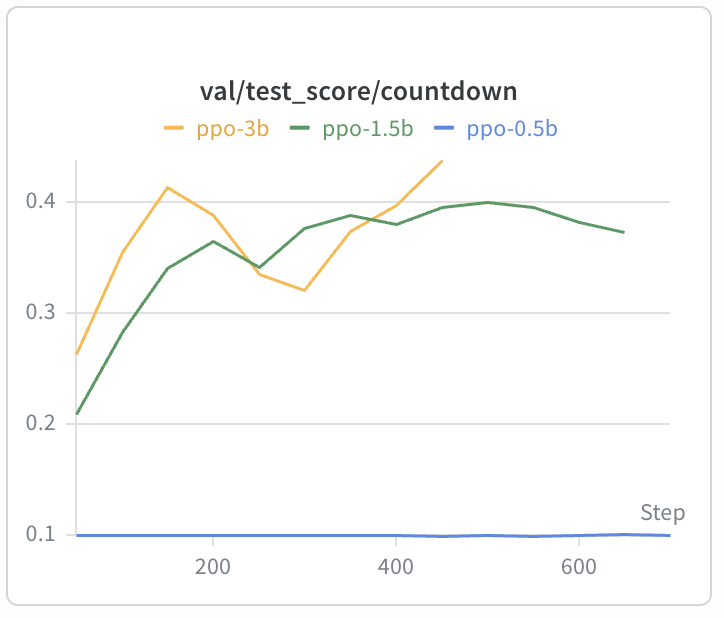
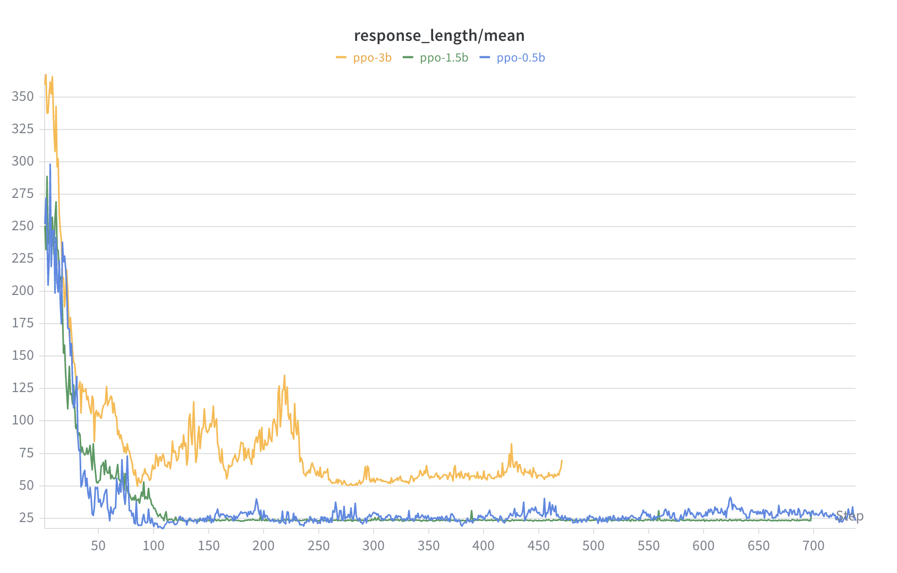
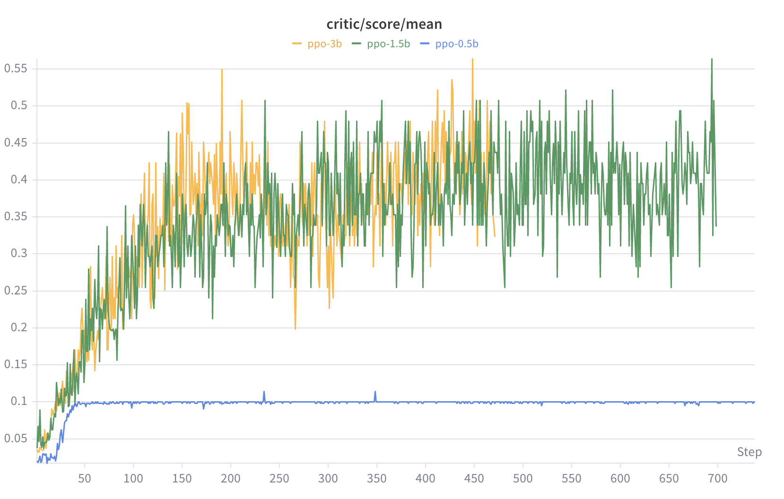
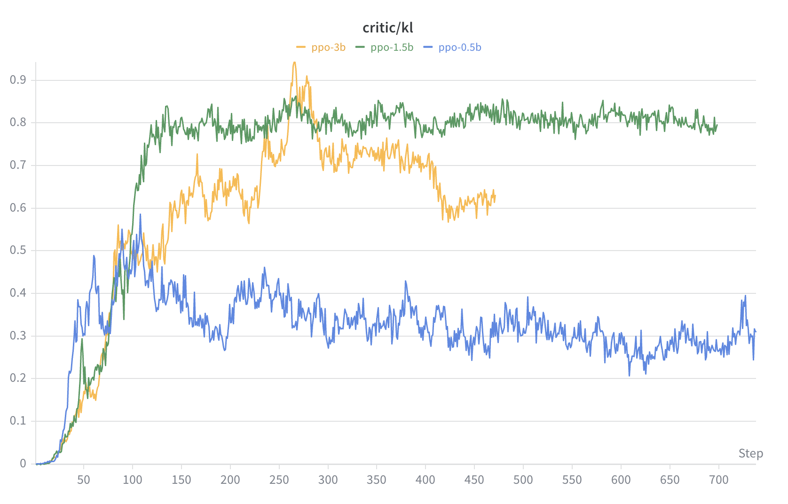

# PPO Countdown Scale Ablation：0.5B / 1.5B / 3B

## 1. 实验设计

### 1.1 核心问题

| 问题 | 实验对比 |
|------|----------|
| Q1：0.5B 能学到什么？ | PPO baseline，定量 + 定性分析 |
| Q2：模型规模影响多大？ | 0.5B / 1.5B / 3B，同算法 PPO |

### 1.2 任务与 Prompt

- **任务**：Countdown（给定 3–4 个数字，用加减乘除凑出目标值，每个数最多用一次）
- **算法**：PPO（adv_estimator=GAE，无 reward model，纯 rule-based reward）
- **目标**：复现 CoT 思维链涌现现象，观察模型规模对涌现的影响
- **控制变量**：三个实验除模型大小和 GPU 数量外，所有超参数一致

**Prompt 格式（Base template）：**

```
A conversation between User and Assistant. The user asks a question, and the
Assistant solves it. The assistant first thinks about the reasoning process in
the mind and then provides the user with the answer.
User: Using the numbers [A, B, C], create an equation that equals T. You can
use basic arithmetic operations (+, -, *, /) and each number can only be used
once. Show your work in <think> </think> tags. And return the final answer in
<answer> </answer> tags, for example <answer> (1 + 2) / 3 </answer>.
Assistant: Let me solve this step by step.
<think>
```

所有模型（0.5B、1.5B、3B）使用同一份 parquet 数据和同一 Base template。0.5B 使用 Qwen2-0.5B（上一代），1.5B 和 3B 使用 Qwen2.5，规模对比中存在代际混淆，已在第五节说明。

### 1.3 奖励函数

奖励函数来自 `verl/utils/reward_score/countdown.py`，三档打分：

| 条件 | 分值 | 日志标记 |
|------|------|----------|
| 没有 `<answer>` 标签 | 0 | `No equation found` |
| 有标签但数字不合法或答案错误 | 0.1 | `Invalid equation` / `Wrong result` |
| 方程正确 | 1.0 | `Correct equation` |

关键设计细节：
- `extract_solution` 只看 Assistant 输出的**最后一行**里的 `<answer>` 标签
- `validate_equation` 提取方程中所有数字，排序后与可用数字**严格比对**（不能多用、少用、捏造）
- `<think>` 标签**不在奖励函数中**。推理过程应自发涌现，而非被显式奖励

`format_score=0.1` 使得有 `<answer>` 标签但答案错误的样本也能拿到 0.1 分。

### 1.4 实验配置约束说明

**官方脚本 `train_tiny_zero.sh` 硬编码 `train_batch_size=256, max_response_length=1024`，但 README 未将这两个参数标注为复现关键依赖。**

本实验因显存限制，0.5B / 1.5B / 3B 均使用 `batch=64`，`max_response_length=512`。这一约束贯穿全文，是部分结论与官方结果产生差距的结构性原因。

---

## 2. 实验参数

### 2.1 基本配置

| 参数 | 0.5B | 1.5B | 3B |
|------|------|------|----|
| **模型** | Qwen2-0.5B | Qwen2.5-1.5B | Qwen2.5-3B |
| **实验名** | first-run | ppo-1.5b | ppo-3b |
| **GPU 数量** | 1 × A100 80G | 1 × A100 80G | 2 × A100 80G |
| **Tensor 并行** | 1 | 1 | 2 |
| **Total epochs** | 15 | 15 | 15 |

### 2.2 数据配置

| 参数 | 0.5B | 1.5B | 3B |
|------|------|------|----|
| **train_batch_size** | 64 | 64 | 64 |
| **val_batch_size** | 128 | 128 | 128 |
| **max_prompt_length** | 256 | 256 | 256 |
| **max_response_length** | 512 | 512 | 512 |

### 2.3 Actor 训练配置

| 参数 | 0.5B | 1.5B | 3B |
|------|------|------|----|
| **actor lr** | 1e-6 | 1e-6 | 1e-6 |
| **critic lr** | 1e-5 | 1e-5 | 1e-5 |
| **ppo_epochs** | 1 | 1 | 1 |
| **clip_ratio** | 0.2 | 0.2 | 0.2 |
| **cliprange_value** | 0.5 | 0.5 | 0.5 |
| **entropy_coeff** | 0.001 | 0.001 | 0.001 |
| **kl_coef** | 0.001 | 0.001 | 0.001 |
| **ppo_mini_batch_size** | 16 | 16 | 16 |
| **ppo_micro_batch_size (actor)** | 4 | 4 | **2** |
| **ppo_micro_batch_size (critic)** | 4 | 4 | **2** |

### 2.4 Rollout 配置

| 参数 | 0.5B | 1.5B | 3B |
|------|------|------|----|
| **temperature** | 1.0 | 1.0 | 1.0 |
| **rollout n** | 1 | 1 | 1 |
| **top_k / top_p** | -1 / 1.0 | -1 / 1.0 | -1 / 1.0 |
| **gpu_memory_utilization** | 0.3 | **0.4** | **0.4** |
| **max_num_batched_tokens** | 8192 | 8192 | 8192 |
| **max_num_seqs** | 1024 | 1024 | 1024 |

### 2.5 三实验差异汇总

三个实验是干净的 model scale ablation，**唯一的非模型差异**：

| 差异点 | 原因 |
|--------|------|
| 3B micro_batch_size: 4 → 2 | 显存不足，减半以适配 2 GPU |
| 1.5B / 3B gpu_memory_utilization: 0.3 → 0.4 | 模型更大，需要更多显存 |
| 3B tensor_model_parallel_size: 1 → 2 | 单卡放不下 3B 模型 |

---

## 3. 训练曲线

> 数据来源：wandb 日志。日志以 1/64 概率随机采样打印，每隔 50 步有一次 eval 批量打印。总采样约 600–936 条/模型，统计误差约 ±3%。

### 3.1 Reward 曲线（val/test_score/countdown）



- **0.5B**：全程平坦在 0.1，即 format_score 下限。模型从未获得过 accuracy reward。
- **1.5B**：从 0.21 快速上升到 ~0.40，在 step 200 后趋于平稳。
- **3B**：起步略高于 1.5B（0.26），中期有回落（step 200–350 降到 ~0.33），后期反弹到 0.43，是三者最高。

### 3.2 Response Length



三个模型早期都输出长文本（250–370 tokens），之后迅速压缩：

- **1.5B** 收敛最快、最短（step 100 后稳定在 ~25 tokens）。
- **0.5B** 也降到 ~25–30 tokens。
- **3B** 始终最长（~50–70 tokens）。

### 3.3 Critic Score



- **0.5B**：稳定在 ~0.1。
- **1.5B / 3B**：逐步上升到 0.3–0.5。

### 3.4 KL Divergence



- **1.5B**：最高（~0.8）。
- **3B**：上升到 ~0.7–0.8，路径更平滑。
- **0.5B**：~0.3。

---

## 4. 分析

### 4.1 跨模型对比总览

| 指标 | 0.5B | 1.5B | 3B |
|------|------|------|----|
| 平均 Reward | 0.097 | 0.349 | 0.342 |
| 后期 Reward（最后20%步） | 0.099 | 0.385 | 0.438 |
| 整体正确率 | 0% | 27.8% | 27.1% |
| 后期正确率 | 0% | 32% | 38% |
| 3 数字正确率 | 0% | 49.1% | 48.8% |
| 4 数字正确率 | 0% | 9.0% | 8.2% |
| Think 非空率（后期） | 96% | 0% | 100% |
| Think 含自然语言推理（后期） | 3% | 0% | 100% |
| Answer 含方程率（后期） | 31% | 100% | 100% |

### 4.2 三种策略：同一 reward 信号下的分化

同样的 reward 函数（0 / 0.1 / 1.0 三档），三个模型学到了三种截然不同的策略：

**0.5B — 格式模仿，卡在 reward=0.1**

```
<think> 37 + 79 - 39 </think> <answer> 146 </answer>    ← Invalid
<think> 1 = 84 </think> <answer>84 </answer>             ← Invalid
```

Think 里有算术表达式（69%）。Answer 里放的是纯数字（65%）或用错数字的方程（27%），从未写出一个合法方程（Wrong result = 0 条）。

**1.5B — think 为空，直接输出方程**

```
<think> </think> <answer> (80 - 54) + 38 </answer>      ← Correct
<think> </think> <answer> (61 - 41) + 33 - 3 </answer>  ← Wrong (=50, target=27)
```

训练早期 think 中有内容，step 70–140 之间 think 非空率从 72% 骤降到 0%。后期 think 标签内始终为空，模型跳过推理直接在 answer 中输出方程。整体正确率 27.8%。

**3B — 自然语言规划 + 方程**

```
<think> Take 87 and subtract 54 to get 33. Add 4 to 33 to get 37.</think>
<answer>87 - 54 + 4</answer>                              ← Correct

<think> Take 30 away from 83 to get 53. Add 14 to 53 to get 67.</think>
<answer>83 - 30 + 14 </answer>                             ← Correct
```

后期 think 100% 非空、100% 含自然语言推理。三者中唯一在后期 think 中有内容的模型。

### 4.3 0.5B 输出分布

对 934 个样本做互斥分类（合计 934/934 ✓）：

| 分类 | 数量 | 比例 | 说明 |
|------|------|------|------|
| answer 放纯数字 | 606 | 64.9% | |
| answer 有方程但数字不对 | 254 | 27.2% | validate_equation 失败 |
| answer 其他内容 | 44 | 4.7% | 非 ASCII 运算符（÷）、文本等 |
| 无 answer 标签 | 17 | 1.8% | |
| answer 空内容 | 8 | 0.9% | `<answer></answer>` |
| answer 含方程其他 | 5 | 0.5% | 日志截断/未判定 |

27% 的样本在 answer 里放了含运算符的方程，但全部使用了错误的数字，没有一条通过数字校验（Wrong result = 0 条）。

Reward 分布：934 个样本中，907 个拿 0.1 分，25 个拿 0 分，0 个拿 1.0 分。97% 的样本分数相同（0.1）。

### 4.4 3B 的思维演化过程

3B 的 think 内容按训练阶段统计（数据来源：`eval_think_analysis.py` 解析 `logs/ppo3B.txt`）：

| 训练阶段 | Think 含算术 | Think 含回溯 | Think 含 NL 推理 | 正确率 |
|----------|-------------|-------------|-----------------|--------|
| 早期 (step 1–47) | 70% | 21% | 88% | 3% |
| 中期 (step 95–141) | 22% | 0% | 97% | 25% |
| 后期 (step 424–470) | 0% | 1% | 100% | 42% |


### 4.5 1.5B vs 3B 对比

| 指标 | 1.5B | 3B |
|------|------|----|
| 整体正确率 | 27.8% | 27.1% |
| 后期正确率（最后 20% 步数） | 32% | 38% |
| 最后阶段正确率 | 30%（step 631-700） | 42%（step 424-470） |
| 后期 response length | ~25 tokens | ~50-70 tokens |
| 后期 think 非空率 | 0% | 100% |
| KL | ~0.8 | ~0.7-0.8 |

---

## 5. 结论

**1. 0.5B 在本实验条件下未能产生任何正确答案。**

934 个样本中，正确率 0%，Wrong result 0 条。27% 的样本在 answer 中写出了含运算符的方程，但全部未通过数字校验。Reward 分布：97% 的样本得 0.1 分，0 个样本得 1.0 分。

**2. 1.5B 和 3B 的整体正确率相近，但后期表现和输出模式不同。**

整体正确率 1.5B 27.8%、3B 27.1%。后期正确率 3B（38%）高于 1.5B（32%），3B 最后阶段达到 42%。1.5B 后期 think 非空率 0%、response length ~25 tokens；3B 后期 think 非空率 100%、response length ~50-70 tokens。

**3. 三个模型在相同 reward 函数下形成了不同的输出模式。**

0.5B 在 answer 中以纯数字为主（65%）；1.5B 在 answer 中输出方程（100%）但 think 为空；3B 在 answer 中输出方程（100%）且 think 中有自然语言内容（100%）。

**4. 本实验使用 batch=64，与官方推荐的 batch=256 不同。**

后续实验（见 `4.20 - batch_size_aha_moment_ablation.md`）表明，batch=64 下训练的 grad_norm 和 KL 波动显著大于 batch=128。本实验的结果可能受到 batch size 的影响。

---

## 6. 局限性

### 6.1 采样偏差

训练日志以 1/64 概率随机打印，每隔 50 步有一次 eval 批量打印（贡献约 24% 样本）。eval 步和普通步的正确率差异 <2%，不影响趋势分析，但对绝对数字应保留 ±3% 的统计误差。

### 6.2 模型代际混淆

0.5B 使用 Qwen2-0.5B，1.5B 和 3B 使用 Qwen2.5。规模对比中存在代际混淆。

### 6.3 Batch size 和 response length 的影响

本实验使用 batch=64、max_response_length=512，而官方推荐 batch=256、length=1024。较小的 batch 可能导致梯度估计噪声更大、训练不稳定, 虽然reponse length 减半，但 Countdown 任务的一开始平均正确答案长度约300+tokens，512 的上限应该足够，不太可能成为性能瓶颈。

    